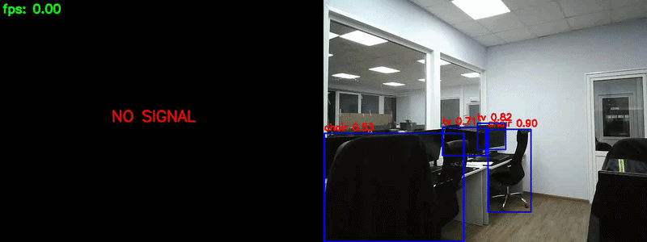
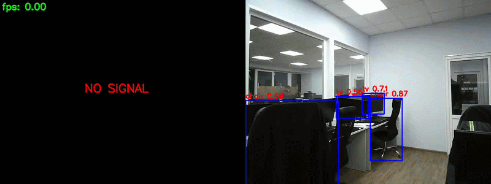
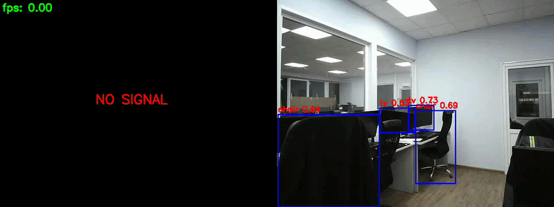

# ROC-RK3588-CV

Проект ROC-RK3588-CV предоставляет готовую архитектуру для запуска детекции объектов на RK3588 с помощью модели YOLOv5, сохранения результатов и вывода через WebUI.

## Структура проекта

- `main.py` — основной входной файл. Загружает конфигурацию из `config.json`, запускает обработку камеры, инференс, хранение данных и отображение результата.
- `config.json` — конфигурация проекта:
  - параметры камеры (`source`, `width`, `height`, `fps`, `pixel_format`)
  - параметры инференса (`new_model`, `obj_thresh`, `nms_thresh`, `classes`)
  - состояния хранилищ, WebUI, ByteTrack и счетчика пульса.
- `run.sh` — оболочка для запуска `main.py` в Conda-окружении `rknn_yolo`.
- `install/requirements.txt` — зависимости Python для работы проекта и WebUI.
- `models/` — папка с RKNN-моделями, используемыми для инференса.
- `saved_videos/` — папка с примерами сохраненных видео результатов инференса.
- `addons/` — дополнительные модули:
  - `byte_tracker/` — реализация ByteTrack для трекинга объектов.
  - `pulse_counter/` — модуль подсчета событий/импульсов.
  - `storages/` — хранилища для кадров, инференс-данных и детекций.
  - `webui/` — веб-интерфейс для визуализации и управления.
- `base/` — основной код платформы RK3588:
  - `camera/` — работа с камерой и настройка потока.
  - `inference/` — запуск инференса на RKNN.
  - `pre_process/`, `post_process/` — подготовка и постобработка данных.
- `utils.py` — вспомогательные утилиты для подсчетов, заполнения хранилищ и отображения.

## Запуск

1. Установите зависимости из `install/requirements.txt`.
2. Активируйте Conda-окружение `rknn_yolo`:

```bash
conda activate rknn_yolo
```

3. Запустите проект через `run.sh`:

```bash
./run.sh
```

> `run.sh` предполагает, что используется Python из активного окружения и что устройство камеры доступно по `/dev/video11`.

Если требуется изменить источник камеры, модель или другие параметры, отредактируйте `config.json`.

## Примеры результатов

Ниже приведены примеры GIF-демонстраций с результатами инференса, сохраненные в папке `saved_videos/gif/`.

### YOLOv5m Leaky



### YOLOv5m Leaky 352x352



### YOLOv5n RK3588 INT8



## Примечания

- Используемые модели хранятся в `models/` и могут быть заменены на другие RKNN-файлы.
- `saved_videos/` содержит реальные примеры работы инференса для проверки качества и производительности.
- WebUI доступен при включенном `webui.state` в `config.json`.
